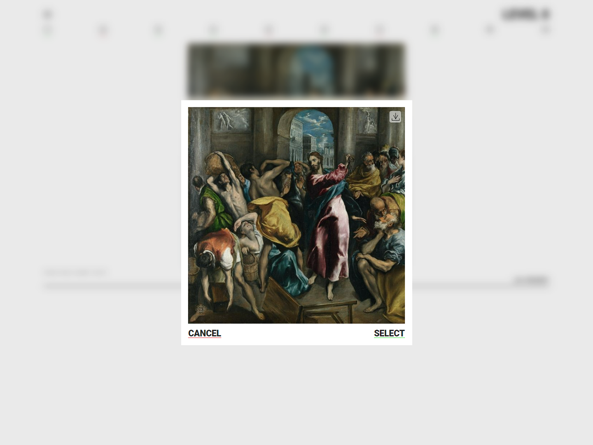

# fe-training-JSFE2021Q3-art-quiz
        

Originally done in rolling-scopes-school/thirdmadman-JSFE2021Q3, public reupload

## Deploy link

<https://thirdmadman.github.io/fe-training-JSFE2021Q3-art-quiz/>

## Screenshots

### Levels screen

### Quiz picture select screen

### Score screen

## Description

Link for original task: <https://github.com/rolling-scopes-school/tasks/blob/master/tasks/art-quiz/art-quiz.md>

### App description

ArtQuiz is single page application, quiz, that tests the user's knowledge of famous artworks and their creators. Database of artists and paintings is organized into categories and application generates questions randomly, by levels. The user is presented with four possible answers to choose from, and the application provides feedback on whether the answer is correct or not.

### Used technologies

This app uses webpack, js, scss, eslint and prettier.

This front end application written contents of two parts:

#### "Back end"

Static content served from github.com, deployed in gh-pages, via gh-pages branch.

Pictures stored in static/img/jpg/,  there are cropped in square images and full size images.

Json file with list of data:

* "author" - Name of the author
* "name" - Name of the artwork
* "year" - Year of the creation of the artwork
* "imageId" - image id in static images assets

Json file has been translated thru small script specially written to this:
/src/js/utils/src-remaker.js

#### Front end

Source coed dived into MVC-like architecture, which uses native JS and components. In is consist of:

* Models
* View/Pages and their components
* Controllers
* Services
* Constants

App stores data in Local Storage, using DataLocalStorageProvider.

Translation works thru LocaleProvider.

And routing uses PathBus and Router.

After first init, app will get Json data from static back end, and then generate questions database, and save it in local storage.
After each reload of the app, it will try to get saved data from local storage.
App will generate level with number of questions from AppGlobalConstants.

After generating process, level will be accessible form "Levels" page.

Each question every time will mix order of questions. After each answer, data of it, will be saved in database, and results will be available in "Results" page.

After completing level with 80% accuracy, app will open next level.

### Requirements has been

1. Use: JS, HTML, CSS, Webpack
2. Don't use: frameworks for JS, jQuery
3. User YOUR own original code, make it clean and readable

### Features

* Unique Design, developed by my for this app: <https://www.figma.com/file/5iJ4kCjiuJEOJhNNwHNG4K/art-quiz?node-id=0%3A1&t=g4l7AybRuqQIDbUE-0>
* Adaptive layout, up to 1920px, down to 320px
